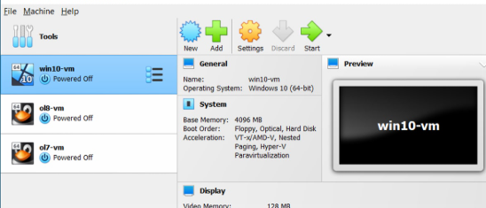

# Installation
For this project, we need 2 Virtual Machine : Metasploitable 2 and Kali Linux
For me, I use VirtualBox but you can use any other virtualization software 
### Metasploitable 2
Metasploitable 2 is an intentionally vulnerable virtual machine designed for testing security tools and demonstrating common vulnerabilities, we can simulate in it real-world attack scenarios safely. It is based on Ubuntu and was created by Rapid7 to learn basics of pentesting.
### Kali Linux
Kali Linux is a Linux distribution specialy made for pentesting, It is a Debian-based distribution packed with various tools for penetration testing, digital forensics, and reverse engineering. Whether you’re an experienced hacker or just getting started in the field, Kali Linux provides a flexible and user-friendly platform.

=> To learn with this Lab, you need to know the basics of Linux, networking and cybersecurity in general.

## How to install our 2 machine ?
### For Metasploitable 2
The first step is to obtain the Metasploitable 2 virtual machine image. This is freely available for download. We need to navigate to the website (some links below) and download the Metasploitable 2 file. This file will be in a compressed format, so after downloading the file, we need to unzip it. This will provide a .vmdk file, which is the virtual hard disk for the VM.​

- https://sourceforge.net/projects/metasploitable/
- https://www.rapid7.com/products/metasploit/metasploitable/

#### VirtualBox
1.Open VirtualBox and click on “New”.

2.Name the VM (choose the name you want).

3.Set the Type to “Linux” and Version to “Other Linux”.

4.Allocate at least 512 MB of RAM (Default).

5.Choose “Use an existing virtual hard disk file” and select the extracted .vmdk file.

6.Finish the setup.

This process sets up the VM using the provided virtual disk.

### For Kali Linux
We need to go to the official website of Kali Linux, and select the correct platform, for my, I will go for VirtualBox prebuilt image.

#### VirtualBox
When we have our image, on VirtualBox, we click on "Add" or "Open"

